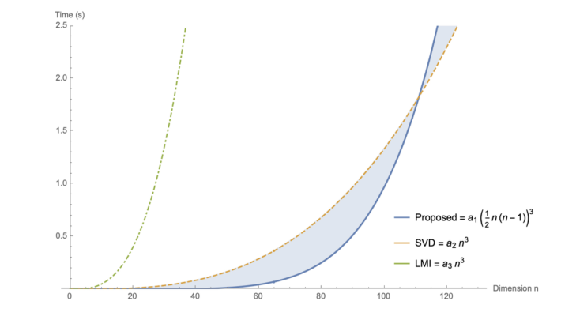
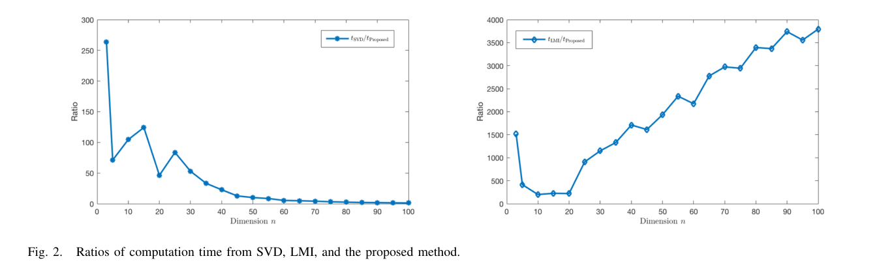
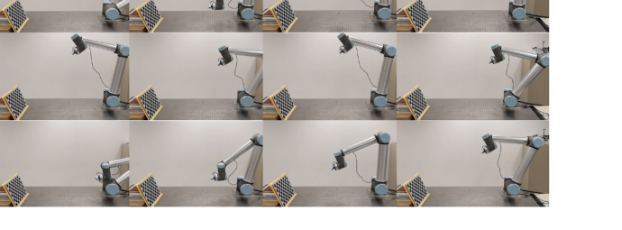
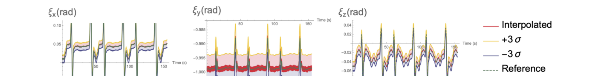
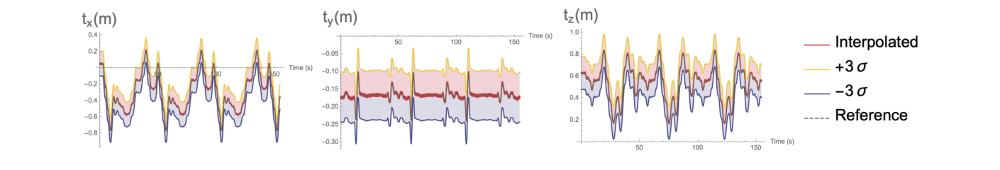
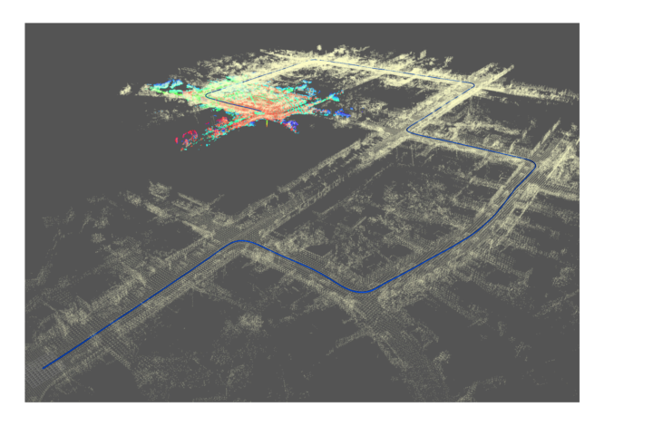

# GLnR point-cloud registration (PCL / C++)

This repository provides a **PCL/C++ implementation of GLnR (Generalized Linear *n*-Dimensional Rigid Registration)** from:

- **Jin Wu et al.** “Generalized n-Dimensional Rigid Registration: Theory and Applications”, *IEEE Transactions on Cybernetics*, 2023.

The paper derives a **closed-form linear least-squares** solution for rigid registration in *n* dimensions using the **Cayley rotation parameterization**.
This project adapts the core idea to practical point-cloud alignment by implementing the **3D specialization** and wrapping it in an **ICP-style loop** (nearest-neighbor correspondences + optional RANSAC rejection).

> `docs/paper_figures/` contains **cropped figures from the paper** (for quick reference).

---

## Features

- **GLnR closed-form update step** (3D, SO(3) + translation)
- ICP-like outer loop (NN correspondences) with:
  - max correspondence distance gate
  - optional RANSAC correspondence rejection
  - optional voxel downsampling
- Input formats: `.pcd`, `.ply`, `.vtk` (if PCL has VTK I/O), `.pcl` (treated as `.pcd`)
- Outputs:
  - registered cloud (`.pcd` or `.ply`)
  - 4×4 homogeneous transform matrix (target ← source)
  - optional visualization via `pcl::visualization::PCLVisualizer`
- Tested for API compatibility with **PCL 1.8.0 → 1.12.0**

---

## 1) Theory recap (GLnR in a nutshell)

Rigid registration estimates a rotation `R` and translation `t` that best align paired points:

$\min_{R\in SO(n),\, t\in \mathbb{R}^n} \sum_{i=1}^{N} w_i \lVert b_i - R r_i - t \rVert^2$

GLnR introduces a Cayley-parameterized rotation

$R = (I + G)^{-1}(I - G)$\
where `G` is skew-symmetric.

After removing translation by centering both sets:

- \(\tilde b_i = b_i - \bar b\), \(\tilde r_i = r_i - \bar r\)
- \(x_i = \tilde b_i + \tilde r_i\), \(d_i = \tilde r_i - \tilde b_i\)

the problem becomes a linear least-squares over a minimal parameter vector `g` describing `G`:

$\min_{G=-G^\top} \sum_i w_i \lVert G x_i - d_i \rVert^2$

Using a linear mapping \(G(g)x_i = P(x_i)g\), the normal equations are:

$H g = v,\quad H = \sum_i w_i P(x_i)^\top P(x_i),\quad v = \sum_i w_i P(x_i)^\top d_i$

Then:

- solve `g` (in this repo: SVD-based least squares)
- reconstruct `R` via Cayley
- recover translation $t = \bar b - R \bar r$

**Note:** Cayley has a known singularity near 180° rotations. In practice, the ICP-style outer loop uses *small incremental updates*, which reduces the chance of hitting this singularity.

---

## 2) Engineering context & key results from the paper

The paper’s main points you’ll see reflected in this implementation are:

- **Closed-form linear solve:** GLnR avoids iterative nonlinear rotation optimization by converting to a linear system in Cayley parameters.
- **Computation-time behavior:** for increasing dimension `n`, the method can be faster than SVD in many regimes, with a reported intersection around `n = 112` (machine-dependent). (See figures below.)
- **Applications shown in the paper:** covariance-preserving SE(3) interpolation and covariance-aided LiDAR mapping.

### Cropped figures

#### Fig. 1 — Time complexity trends



#### Fig. 2 — Time ratio vs dimension



#### Fig. 3 — UR10 motion capture sequence



#### Fig. 4–5 — SE(3) interpolation with 3σ bounds





#### Fig. 6 — Covariance-aided LiDAR mapping example



---

## 3) Build

### Dependencies

- PCL (1.8.0 → 1.12.0)
- Eigen (pulled by PCL on most systems)
- VTK (optional; required for `--source *.vtk` / `--target *.vtk` and visualization on many PCL builds)

### Compile

```bash
mkdir -p build
cd build
cmake ..
make -j
```

If your PCL is not found automatically:

```bash
cmake .. -DPCL_DIR=/path/to/pcl/cmake
```

---

## 4) Run

Basic usage:

```bash
./glnr_register \
  --source source.pcd \
  --target target.pcd \
  --output aligned.pcd \
  --transform transform.txt \
  --visualize
```

A more typical setup (downsample + gated correspondences + RANSAC):

```bash
./glnr_register \
  --source source.pcd \
  --target target.pcd \
  --output aligned.pcd \
  --transform transform.txt \
  --max_iter 50 \
  --corr_dist 0.10 \
  --ransac 0.05 \
  --ransac_iter 2000 \
  --voxel 0.02 \
  --visualize
```

### CLI options

- `--source <file>`: source point cloud (`.pcd`, `.ply`, `.vtk`, `.pcl`)
- `--target <file>`: target point cloud
- `--output <file>`: aligned output (`.pcd` or `.ply`)
- `--transform <file>`: output 4×4 transform matrix (text)

Registration loop:

- `--max_iter <int>`: max outer iterations (default: 40)
- `--corr_dist <float>`: maximum correspondence distance (meters)
- `--trans_eps <float>`: convergence threshold for incremental motion

Robustness / speed:

- `--voxel <float>`: voxel size (meters), `0` disables
- `--ransac <float>`: RANSAC inlier threshold (meters), `0` disables
- `--ransac_iter <int>`: number of RANSAC iterations

Visualization:

- `--visualize`: show (target, source, aligned)

---

## 5) Outputs

### Registered point cloud

`--output aligned.pcd` or `--output aligned.ply`

### Transformation

`--transform transform.txt` contains the 4×4 matrix in row-major text form:

```text
r00 r01 r02 tx
r10 r11 r12 ty
r20 r21 r22 tz
0   0   0   1
```

The convention is:

$ p_{target} \approx T \cdot p_{source} $

---

## 6) Repository layout

```
.
├── CMakeLists.txt
├── include/glnr/glnr_solver.h   # GLnR 3D closed-form step
├── src/glnr_register.cpp        # ICP-style wrapper + I/O + viz
└── docs/paper_figures/          # cropped figures from the paper
```

---

## 7) Limitations & next steps

- This repo implements the **3D** case (SO(3)+t). The paper supports general *n*.
- The paper derives **covariances** for rotation/translation; this repo currently outputs only the transform.
- Cayley parameterization is not ideal for near-180° updates; for very large initial misalignment, you may need a coarse alignment step first.

Possible extensions:

- Add covariance output (propagate based on the paper’s closed-form covariance expressions).
- Expose an initial guess (`--init_transform`) and/or integrate a global coarse matcher.
- Implement the general `SO(n)` solver (useful for hand–eye calibration and SE(n)→SO(n+1) embeddings described in the paper).

---

## Reference

If you use this code, please cite the paper:

> Wu, J., Wang, M., Fourati, H., Li, H., Zhu, Y., Zhang, C., Jiang, Y., Hu, X., Liu, M. (2023).
> *Generalized n-Dimensional Rigid Registration: Theory and Applications.* IEEE Transactions on Cybernetics.
